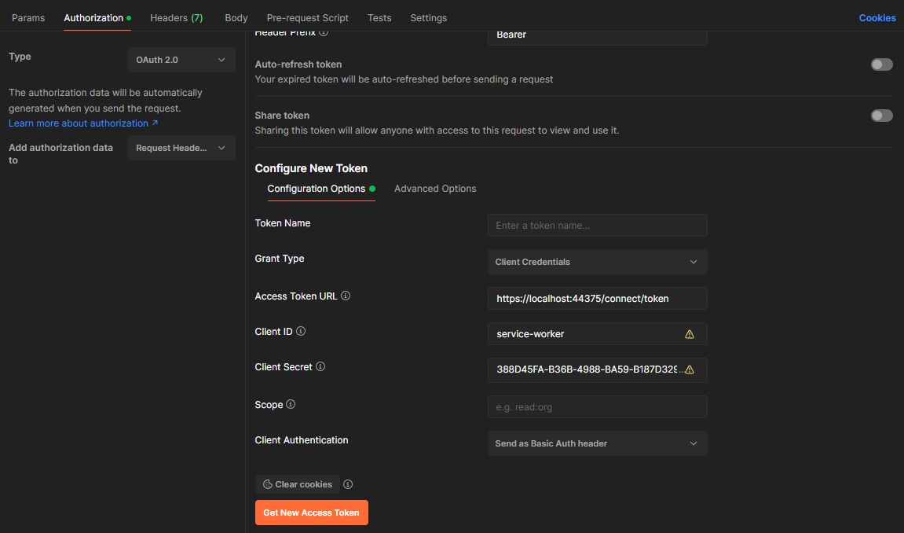

# Creating your own server instance

**To implement a custom OpenID Connect server using OpenIddict, the simplest option is to clone one of the official samples**
from the [openiddict-samples repository](https://github.com/openiddict/openiddict-samples).

If you don't want to start from one of the recommended samples, you'll need to:

  - **Reuse an existing project or create a new one**: when creating a new project using Visual Studio's default ASP.NET Core template,
  using **individual user accounts authentication** is strongly recommended as it automatically includes the default ASP.NET Core Identity UI,
  based on Razor Pages, should you later need to implement a user authentication flow like the authorization code flow.

  - **Update your `.csproj` file** to reference the latest `OpenIddict.AspNetCore` and `OpenIddict.EntityFrameworkCore` packages:

    ```xml
    <PackageReference Include="OpenIddict.AspNetCore" Version="5.2.0" />
    <PackageReference Include="OpenIddict.EntityFrameworkCore" Version="5.2.0" />
    ```

  - **Configure the OpenIddict core and server services** in `Program.cs` (or `Startup.cs`, depending on whether you're using the
  minimal host or the regular host). Here's an example for the client credentials grant, used in machine-to-machine scenarios:

    ```csharp
    services.AddDbContext<ApplicationDbContext>(options =>
    {
        // Configure Entity Framework Core to use Microsoft SQL Server.
        options.UseSqlServer(Configuration.GetConnectionString("DefaultConnection"));

        // Register the entity sets needed by OpenIddict.
        // Note: use the generic overload if you need to replace the default OpenIddict entities.
        options.UseOpenIddict();
    });

    services.AddOpenIddict()

        // Register the OpenIddict core components.
        .AddCore(options =>
        {
            // Configure OpenIddict to use the Entity Framework Core stores and models.
            // Note: call ReplaceDefaultEntities() to replace the default entities.
            options.UseEntityFrameworkCore()
                   .UseDbContext<ApplicationDbContext>();
        })

        // Register the OpenIddict server components.
        .AddServer(options =>
        {
            // Enable the token endpoint.
            options.SetTokenEndpointUris("connect/token");

            // Enable the client credentials flow.
            options.AllowClientCredentialsFlow();

            // Register the signing and encryption credentials.
            options.AddDevelopmentEncryptionCertificate()
                   .AddDevelopmentSigningCertificate();

            // Register the ASP.NET Core host and configure the ASP.NET Core options.
            options.UseAspNetCore()
                   .EnableTokenEndpointPassthrough();
        });

    // Register the worker responsible of creating the EntityFramework Core database.
    // Note: in a real world application, this step should be part of a setup script.
    services.AddHostedService<Worker>();
    ```

  - **Make sure the ASP.NET Core authentication middleware is correctly registered at the right place**:

    ```csharp
    app.UseDeveloperExceptionPage();

    app.UseRouting();
    app.UseCors();

    app.UseAuthentication();
    app.UseAuthorization();

    app.UseEndpoints(options =>
    {
        options.MapControllers();
        options.MapDefaultControllerRoute();
    });
    ```

  - **Create your own authorization controller:**
    Implementing a custom authorization controller is required to allow OpenIddict to create tokens based on the identities and claims you provide.
    Here's an example for the client credentials grant:

    ```csharp
    public class AuthorizationController : Controller
    {
        private readonly IOpenIddictApplicationManager _applicationManager;

        public AuthorizationController(IOpenIddictApplicationManager applicationManager)
            => _applicationManager = applicationManager;

        [HttpPost("~/connect/token"), Produces("application/json")]
        public async Task<IActionResult> Exchange()
        {
            var request = HttpContext.GetOpenIddictServerRequest();
            if (request.IsClientCredentialsGrantType())
            {
                // Note: the client credentials are automatically validated by OpenIddict:
                // if client_id or client_secret are invalid, this action won't be invoked.

                var application = await _applicationManager.FindByClientIdAsync(request.ClientId) ??
                    throw new InvalidOperationException("The application cannot be found.");

                // Create a new ClaimsIdentity containing the claims that
                // will be used to create an id_token, a token or a code.
                var identity = new ClaimsIdentity(TokenValidationParameters.DefaultAuthenticationType, Claims.Name, Claims.Role);

                // Use the client_id as the subject identifier.
                identity.SetClaim(Claims.Subject, await _applicationManager.GetClientIdAsync(application));
                identity.SetClaim(Claims.Name, await _applicationManager.GetDisplayNameAsync(application));

                identity.SetDestinations(static claim => claim.Type switch
                {
                    // Allow the "name" claim to be stored in both the access and identity tokens
                    // when the "profile" scope was granted (by calling principal.SetScopes(...)).
                    Claims.Name when claim.Subject.HasScope(Scopes.Profile)
                        => [Destinations.AccessToken, Destinations.IdentityToken],

                    // Otherwise, only store the claim in the access tokens.
                    _ => [Destinations.AccessToken]
                });

                return SignIn(new ClaimsPrincipal(identity), OpenIddictServerAspNetCoreDefaults.AuthenticationScheme);
            }

            throw new NotImplementedException("The specified grant is not implemented.");
        }
    }
    ```

  - **Register your client application** (e.g using an `IHostedService` implementation):

    ```csharp
    public class Worker : IHostedService
    {
        private readonly IServiceProvider _serviceProvider;

        public Worker(IServiceProvider serviceProvider)
            => _serviceProvider = serviceProvider;

        public async Task StartAsync(CancellationToken cancellationToken)
        {
            using var scope = _serviceProvider.CreateScope();

            var context = scope.ServiceProvider.GetRequiredService<ApplicationDbContext>();
            await context.Database.EnsureCreatedAsync();

            var manager = scope.ServiceProvider.GetRequiredService<IOpenIddictApplicationManager>();

            if (await manager.FindByClientIdAsync("service-worker") is null)
            {
                await manager.CreateAsync(new OpenIddictApplicationDescriptor
                {
                    ClientId = "service-worker",
                    ClientSecret = "388D45FA-B36B-4988-BA59-B187D329C207",
                    Permissions =
                    {
                        Permissions.Endpoints.Token,
                        Permissions.GrantTypes.ClientCredentials
                    }
                });
            }
        }

        public Task StopAsync(CancellationToken cancellationToken) => Task.CompletedTask;
    }

    ```

  > [!NOTE]
  > Before running the application, make sure the database is updated with OpenIddict tables by running `Add-Migration` and `Update-Database`.

  - Test your server implementation using Postman:



Recommended read: [Implementing token validation in your APIs](implementing-token-validation-in-your-apis.md).