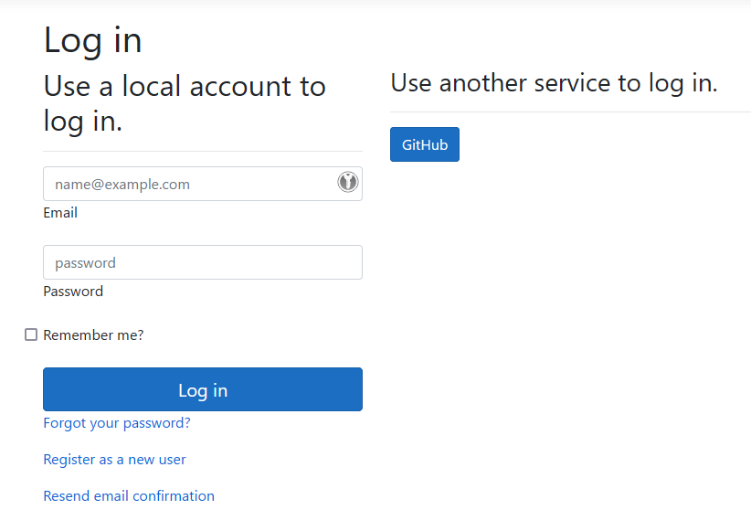

# Integrating with a remote server instance

The OpenIddict client is a universal OAuth 2.0/OpenID Connect .NET client that can be used in both web applications
(ASP.NET 4.6.1+ or ASP.NET Core 2.1+ required) or desktop applications (.NET 4.6.1+ or .NET 6.0+ required).

Most of the settings apply to both web and desktop applications but interactive flows like the
code or implicit flows require a specific integration depending on the type of application:

## Implement a non-interactive OAuth 2.0 client in any .NET application:

Non-interactive flows like the resource owner password credentials (ROPC) or client credentials are implemented the same way
in web and desktop applications. If you want to use a non-interactive flow like the client credentials flow, you'll need to:

  - **Have an existing project or create a new one**: using the .NET generic host is recommended but not mandatory for non-interactive
  flows. In any case, you'll need to use dependency injection (`Microsoft.Extensions.DependencyInjection` or another DI container).

  - **Update your `.csproj` file** to reference the latest `OpenIddict` package:

    ```xml
    <PackageReference Include="OpenIddict" Version="5.2.0" />
    ```

  - **Configure the OpenIddict client services** in `Program.cs` (or `Startup.cs` if you use the regular ASP.NET Core web host):

    ```csharp
    services.AddOpenIddict()

        // Register the OpenIddict client components.
        .AddClient(options =>
        {
            // Allow grant_type=client_credentials to be negotiated.
            options.AllowClientCredentialsFlow();

            // Disable token storage, which is not necessary for non-interactive flows like
            // grant_type=password, grant_type=client_credentials or grant_type=refresh_token.
            options.DisableTokenStorage();

            // Register the System.Net.Http integration.
            options.UseSystemNetHttp();

            // Add a client registration with the client identifier and secrets issued by the server.
            options.AddRegistration(new OpenIddictClientRegistration
            {
                Issuer = new Uri("https://localhost:44385/", UriKind.Absolute),

                ClientId = "service-worker",
                ClientSecret = "388D45FA-B36B-4988-BA59-B187D329C207"
            });
        });
    ```

  - **Use `OpenIddictClientService` to retrieve an access token from the remote server:**
    ```csharp
    var service = provider.GetRequiredService<OpenIddictClientService>();

    var result = await service.AuthenticateWithClientCredentialsAsync(new());
    var token = result.AccessToken;
    ```

## Implement an interactive OAuth 2.0/OpenID Connect client in an ASP.NET Core application:

**To implement an interactive OAuth 2.0/OpenID Connect client in an ASP.NET Core application, the simplest option is to clone
one of the official samples** from the [openiddict-samples repository](https://github.com/openiddict/openiddict-samples).

If you don't want to start from one of the recommended samples, you'll need to:

  - **Have an existing project or create a new one**: when creating a new project using Visual Studio's default ASP.NET Core template,
  using **individual user accounts authentication** is strongly recommended as it automatically includes a default ASP.NET Core Identity UI
  based on Razor Pages, that automatically handles the user creation process or external login integration in a transparent way.

  - **Update your `.csproj` file** to reference the latest `OpenIddict.AspNetCore` and `OpenIddict.EntityFrameworkCore` packages:

    ```xml
    <PackageReference Include="OpenIddict.AspNetCore" Version="5.2.0" />
    <PackageReference Include="OpenIddict.EntityFrameworkCore" Version="5.2.0" />
    ```

  - **Configure the OpenIddict core services** in `Program.cs` (or `Startup.cs`, depending on whether you're using the minimal host or the regular host):

  > [!IMPORTANT]
  > Configuring a database is required because the OpenIddict client is stateful by default: it uses the `IOpenIddictTokenStore<T>`
  > service to store the payload of the state tokens it creates – to protect the callback stage from CSRF/session fixation attacks –
  > and enable automatic state token redeeming (unlike the ASP.NET Core OAuth 2.0 or OpenID Connect handlers, the OpenIddict client
  > prevents state tokens from being used multiple times to mitigate authorization response/state token replay attacks).

    ```csharp
    services.AddDbContext<ApplicationDbContext>(options =>
    {
        // Configure Entity Framework Core to use Microsoft SQL Server.
        options.UseSqlServer(Configuration.GetConnectionString("DefaultConnection"));

        // Register the entity sets needed by OpenIddict.
        // Note: use the generic overload if you need to replace the default OpenIddict entities.
        options.UseOpenIddict();
    });
    ```

    ```csharp
    services.AddOpenIddict()

        // Register the OpenIddict core components.
        .AddCore(options =>
        {
            // Configure OpenIddict to use the Entity Framework Core stores and models.
            // Note: call ReplaceDefaultEntities() to replace the default entities.
            options.UseEntityFrameworkCore()
                   .UseDbContext<ApplicationDbContext>();
        });
    ```

  - **Configure the OpenIddict client services**. Here's an example enabling code flow support and adding the GitHub integration:

    ```csharp
    services.AddOpenIddict()

        // Register the OpenIddict client components.
        .AddClient(options =>
        {
            // Note: this sample only uses the authorization code flow,
            // but you can enable the other flows if necessary.
            options.AllowAuthorizationCodeFlow();

            // Register the signing and encryption credentials used to protect
            // sensitive data like the state tokens produced by OpenIddict.
            options.AddDevelopmentEncryptionCertificate()
                   .AddDevelopmentSigningCertificate();

            // Register the ASP.NET Core host and configure the ASP.NET Core-specific options.
            options.UseAspNetCore()
                   .EnableRedirectionEndpointPassthrough();

            // Register the System.Net.Http integration.
            options.UseSystemNetHttp();

            // Register the Web providers integrations.
            //
            // Note: to mitigate mix-up attacks, it's recommended to use a unique redirection endpoint
            // URI per provider, unless all the registered providers support returning a special "iss"
            // parameter containing their URL as part of authorization responses. For more information,
            // see https://datatracker.ietf.org/doc/html/draft-ietf-oauth-security-topics#section-4.4.
            options.UseWebProviders()
                   .AddGitHub(options =>
                   {
                       options.SetClientId("c4ade52327b01ddacff3")
                              .SetClientSecret("da6bed851b75e317bf6b2cb67013679d9467c122")
                              .SetRedirectUri("callback/login/github");
                   });
        });
    ```

  - **Make sure the ASP.NET Core authentication middleware is correctly registered at the right place**:

    ```csharp
    app.UseDeveloperExceptionPage();

    app.UseRouting();
    app.UseCors();

    app.UseAuthentication();
    app.UseAuthorization();

    app.UseEndpoints(options =>
    {
        options.MapControllers();
        options.MapDefaultControllerRoute();
    });
    ```

  - **Add an authentication controller responsible for handling the OAuth 2.0/OpenID Connect callbacks:**

    ```csharp
    [HttpGet("~/callback/login/{provider}"), HttpPost("~/callback/login/{provider}"), IgnoreAntiforgeryToken]
    public async Task<ActionResult> LogInCallback()
    {
        // Retrieve the authorization data validated by OpenIddict as part of the callback handling.
        var result = await HttpContext.AuthenticateAsync(OpenIddictClientAspNetCoreDefaults.AuthenticationScheme);
    
        // Important: if the remote server doesn't support OpenID Connect and doesn't expose a userinfo endpoint,
        // result.Principal.Identity will represent an unauthenticated identity and won't contain any user claim.
        //
        // Such identities cannot be used as-is to build an authentication cookie in ASP.NET Core (as the
        // antiforgery stack requires at least a name claim to bind CSRF cookies to the user's identity) but
        // the access/refresh tokens can be retrieved using result.Properties.GetTokens() to make API calls.
        if (result.Principal is not ClaimsPrincipal { Identity.IsAuthenticated: true })
        {
            throw new InvalidOperationException("The external authorization data cannot be used for authentication.");
        }
    
        // Build an identity based on the external claims and that will be used to create the authentication cookie.
        var identity = new ClaimsIdentity(authenticationType: "ExternalLogin");
    
        // By default, OpenIddict will automatically try to map the email/name and name identifier claims from
        // their standard OpenID Connect or provider-specific equivalent, if available. If needed, additional
        // claims can be resolved from the external identity and copied to the final authentication cookie.
        identity.SetClaim(ClaimTypes.Email, result.Principal.GetClaim(ClaimTypes.Email))
                .SetClaim(ClaimTypes.Name, result.Principal.GetClaim(ClaimTypes.Name))
                .SetClaim(ClaimTypes.NameIdentifier, result.Principal.GetClaim(ClaimTypes.NameIdentifier));
    
        // Preserve the registration identifier to be able to resolve it later.
        identity.SetClaim(Claims.Private.RegistrationId, result.Principal.GetClaim(Claims.Private.RegistrationId));
    
        // Build the authentication properties based on the properties that were added when the challenge was triggered.
        var properties = new AuthenticationProperties(result.Properties.Items)
        {
            RedirectUri = result.Properties.RedirectUri ?? "/"
        };
    
        // If needed, the tokens returned by the authorization server can be stored in the authentication cookie.
        //
        // To make cookies less heavy, tokens that are not used are filtered out before creating the cookie.
        properties.StoreTokens(result.Properties.GetTokens().Where(token => token.Name is
            // Preserve the access, identity and refresh tokens returned in the token response, if available.
            OpenIddictClientAspNetCoreConstants.Tokens.BackchannelAccessToken   or
            OpenIddictClientAspNetCoreConstants.Tokens.BackchannelIdentityToken or
            OpenIddictClientAspNetCoreConstants.Tokens.RefreshToken));
    
        // Ask the default sign-in handler to return a new cookie and redirect the
        // user agent to the return URL stored in the authentication properties.
        //
        // For scenarios where the default sign-in handler configured in the ASP.NET Core
        // authentication options shouldn't be used, a specific scheme can be specified here.
        return SignIn(new ClaimsPrincipal(identity), properties);
    }
    ```

  - Once correctly configured, the GitHub provider should appear in the list of supported external providers:



## Implement an interactive OAuth 2.0/OpenID Connect client in a desktop application:

**To implement an interactive OAuth 2.0/OpenID Connect client in a desktop application, the simplest option is to clone
one of the official samples** from the [openiddict-samples repository](https://github.com/openiddict/openiddict-samples).

For more information on how to use the `OpenIddict.Client.SystemIntegration` package on Linux and Windows, read
[Introducing system integration support for the OpenIddict client](https://kevinchalet.com/2023/02/27/introducing-system-integration-support-for-the-openiddict-client/).