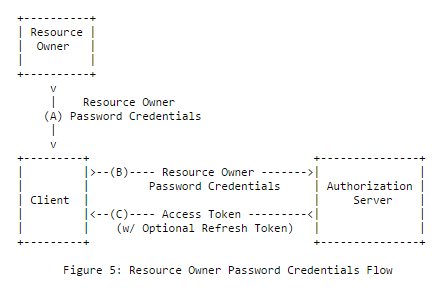
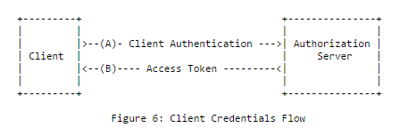
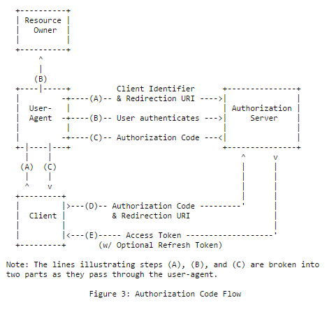
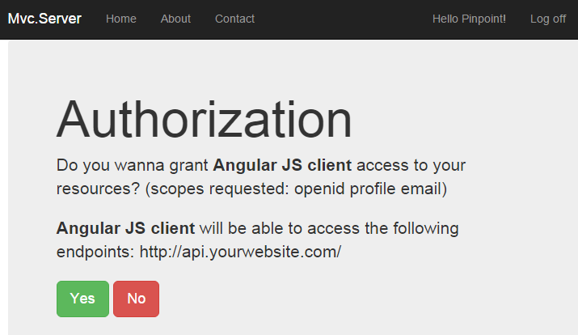
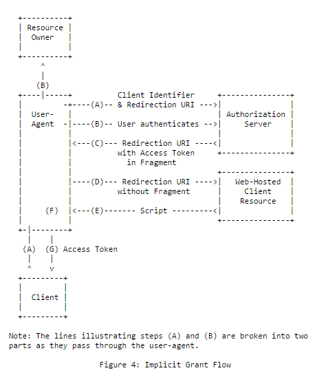

# 选择合适的流程 <Badge type="warning" text="client" /><Badge type="danger" text="server" />

OpenIddict 提供了对 [OAuth 2.0](https://datatracker.ietf.org/doc/html/rfc6749) 和 [OpenID Connect](https://openid.net/specs/openid-connect-core-1_0.html) 核心规范中定义的所有标准流程的内置支持：
[授权码流程](https://openid.net/specs/openid-connect-core-1_0.html#CodeFlowAuth)、
[隐式流程](https://openid.net/specs/openid-connect-core-1_0.html#ImplicitFlowAuth)、
[混合流程](https://openid.net/specs/openid-connect-core-1_0.html#HybridFlowAuth)（通常被视为前两种流程的混合）、
[资源所有者密码凭证授权](https://datatracker.ietf.org/doc/html/rfc6749#section-4.3)和
[客户端凭证授权](https://datatracker.ietf.org/doc/html/rfc6749#section-4.4)。

> [!IMPORTANT]
> 所有这些流程都受到服务器和客户端堆栈的支持，除了传统的 OAuth 2.0 隐式流程（即 `response_type=token`），
> 出于兼容性原因，OpenIddict 服务器支持该流程，但出于安全原因，OpenIddict 客户端不允许协商该流程。

虽然这不是 OpenIddict 特有的，但在实现自己的授权服务器时，为应用程序选择最佳流程是一个**重要的先决条件**；
以下是不同 OAuth 2.0/OpenID Connect 流程的快速概述：

## 非交互式流程

### 资源所有者密码凭证流程（不推荐用于新应用程序）

直接受[基本认证](https://en.wikipedia.org/wiki/Basic_access_authentication)启发，资源所有者密码凭证授权
（缩写为 *ROPC*）在概念上是**最简单的 OAuth 2.0 流程**：客户端应用程序询问用户的用户名/密码，向授权服务器发送包含用户凭证的令牌请求
（根据授权服务器定义的客户端认证策略，可能还需要包含其自己的客户端凭证），并获取一个访问令牌，用于检索用户的资源。



```http
POST /connect/token HTTP/1.1
Host: server.example.com
Content-Type: application/x-www-form-urlencoded

grant_type=password&username=johndoe&password=A3ddj3w
```

```http
HTTP/1.1 200 OK
Content-Type: application/json;charset=UTF-8
Cache-Control: no-store
Pragma: no-cache

{
  "access_token":"2YotnFZFEjr1zCsicMWpAA",
  "token_type":"bearer",
  "expires_in":3600
}
```

> [!CAUTION]
> 此流程**不被 OAuth 2.0 规范推荐**，因为它是唯一一个**用户密码直接暴露给客户端应用程序**的授权类型，
> 这违反了最小权限原则，**使其不适合不能被授权服务器完全信任的第三方客户端应用程序**。
>
> 虽然流行且易于实现（因为它不涉及任何重定向或同意表单，并且与交互式流程不同，不需要实现
> 跨站请求伪造（XSRF）对策来防止会话固定攻击），但**不建议在新应用程序中使用**。相反，
> 鼓励用户使用授权码流程，该流程不会将密码暴露给客户端应用程序，并且不仅限于密码认证。

<!-- more -->

### 客户端凭证授权（推荐用于机器间通信）

客户端凭证授权与资源所有者密码凭证授权几乎相同，只是它专门设计用于**客户端到服务器场景**
（此流程中不涉及用户）：客户端应用程序发送包含其凭证的令牌请求，并获取一个访问令牌，用于查询其自己的资源。



```http
POST /connect/token HTTP/1.1
Host: server.example.com
Content-Type: application/x-www-form-urlencoded

grant_type=client_credentials&client_id=s6BhdRkqt3&client_secret=gX1fBat3bV
```

```http
HTTP/1.1 200 OK
Content-Type: application/json;charset=UTF-8
Cache-Control: no-store
Pragma: no-cache

{
  "access_token":"2YotnFZFEjr1zCsicMWpAA",
  "token_type":"bearer",
  "expires_in":3600
}
```

> [!NOTE]
> 与资源所有者密码凭证授权不同，使用客户端凭证授权时**客户端认证不是可选的**，并且
> **OpenIddict 服务器将始终拒绝未认证的令牌请求**，
> [如 OAuth 2.0 规范所要求](https://datatracker.ietf.org/doc/html/rfc6749#section-4.4.2)。
>
> 这意味着**您不能将客户端凭证授权用于公共应用程序**，如浏览器、
> 移动或桌面应用程序，因为它们无法保持其凭证的秘密性。

## 交互式流程

### 授权码流程（推荐用于新应用程序）

虽然授权码流程可能是最复杂的流程（因为它涉及**用户代理重定向和后端通信**），但它是
**任何涉及最终用户的场景的推荐流程，无论他们是使用密码、PIN、智能卡还是外部提供商登录**。
作为其复杂性的回报，此流程在服务器端应用程序中使用时有一个很大的优势：`access_token` 不能被用户代理拦截。

授权码流程基本上有 2 个步骤：授权请求/响应和令牌请求/响应。



- **步骤 1：授权请求**

在此流程中，客户端应用程序始终通过生成包含
强制性 `response_type=code` 参数、其 `client_id`、其 `redirect_uri` 以及可选的 `scope` 和 `state` 参数的授权请求来启动认证过程
[这些参数允许传递自定义数据并帮助缓解 XSRF 攻击](https://openid.net/specs/openid-connect-core-1_0.html#AuthRequest)。

> [!NOTE]
> 在大多数情况下，客户端应用程序将简单地返回一个带有 `Location` 头的 302 响应，以将用户代理重定向到授权端点，
> 但根据您使用的 OpenID Connect 客户端，也可能支持 POST 请求，以允许您发送大型授权请求。
> 此功能[通常使用自动提交的 HTML 表单实现](https://github.com/aspnet/Security/pull/392)。

```http
HTTP/1.1 302 Found
Location: https://server.example.com/authorize?response_type=code&client_id=s6BhdRkqt3&state=af0ifjsldkj&redirect_uri=https%3A%2F%2Fclient.example.org%2Fcb
```

```http
GET /connect/authorize?response_type=code&client_id=s6BhdRkqt3&state=af0ifjsldkj&redirect_uri=https%3A%2F%2Fclient.example.org%2Fcb HTTP/1.1
Host: server.example.com
```

身份提供商处理授权请求的方式是特定于实现的，但在大多数情况下，会显示一个同意表单
询问用户是否同意与客户端应用程序共享其个人数据。



当同意被给予时，用户代理被重定向回客户端应用程序，并带有**一个唯一且短期的令牌**
名为 *授权码*，客户端将能够通过发送令牌请求来交换访问令牌。

```http
HTTP/1.1 302 Found
Location: https://client.example.org/cb?code=SplxlOBeZQQYbYS6WxSbIA&state=af0ifjsldkj
```

> [!WARNING]
> 为了防止 XSRF/会话固定攻击，**客户端应用程序必须确保身份提供商返回的 `state` 参数
> 与原始 `state` 相对应**，如果两个值不匹配，则停止处理授权响应。
> [这通常通过生成一个不可猜测的字符串和相应的关联 cookie 来完成](https://datatracker.ietf.org/doc/html/rfc6749#section-10.12)。
>
> 此机制完全由 OpenIddict 客户端支持（且不能禁用），但可能不受第三方客户端支持。

- **步骤 2：令牌请求**

当客户端应用程序获取授权码时，它必须立即通过发送 `grant_type=authorization_code` 令牌请求来兑换访问令牌。

> [!NOTE]
> 为了帮助身份提供商[缓解假冒客户端攻击](https://datatracker.ietf.org/doc/html/rfc6819#section-4.4.1.7)，还必须发送原始的 `redirect_uri`。
>
> 如果客户端应用程序是机密应用程序（即已分配客户端凭证的应用程序），则需要认证。

```http
POST /connect/token HTTP/1.1
Host: server.example.com
Content-Type: application/x-www-form-urlencoded

grant_type=authorization_code&code=SplxlOBeZQQYbYS6WxSbIA&redirect_uri=https%3A%2F%2Fclient%2Eexample%2Ecom%2Fcb&client_id=s6BhdRkqt3&client_secret=gX1fBat3bV&scope=openid
```

```http
HTTP/1.1 200 OK
Content-Type: application/json;charset=UTF-8
Cache-Control: no-store
Pragma: no-cache

{
  "access_token":"2YotnFZFEjr1zCsicMWpAA",
  "token_type":"bearer",
  "expires_in":3600
}
```

> [!NOTE]
> 为了提高安全性，可以指定额外的参数，如 `code_challenge` 和 `code_challenge_method`，以将授权端点返回的授权码
> 绑定到原始授权请求。此机制称为[代码交换证明密钥](../configuration/proof-key-for-code-exchange.md)，完全由 OpenIddict 支持。

### 隐式流程（不推荐用于新应用程序）

隐式流程类似于授权码流程，**只是没有令牌请求/响应步骤**：访问令牌直接作为授权响应的一部分在 URI 片段中返回给客户端应用程序
（或在使用 `response_mode=form_post` 时在请求表单中）。

> [!TIP]
> 使用 OpenID Connect 版本的隐式流程时，会返回一个额外的令牌，称为 *身份令牌*，
> 客户端应用程序可以使用它来检索关于用户的标准化信息。



```http
GET /connect/authorize?response_type=token&client_id=s6BhdRkqt3&redirect_uri=https%3A%2F%2Fclient.example.org%2Fcb&scope=openid&state=af0ifjsldkj&nonce=n-0S6_WzA2Mj HTTP/1.1
Host: server.example.com
```

```http
HTTP/1.1 302 Found
Location: https://client.example.org/cb#access_token=SlAV32hkKG&token_type=bearer&expires_in=3600&state=af0ifjsldkj
```

> [!CAUTION]
> 最初为浏览器应用程序设计，此流程本质上不如授权码流程安全，并且不支持
> [代码交换证明密钥](https://datatracker.ietf.org/doc/html/rfc7636)。因此，不建议在新应用程序中使用它。

> [!WARNING]
> 与授权码流程一样，**客户端应用程序必须确保身份提供商返回的 `state` 参数
> 与原始 `state` 相对应**，以缓解 XSRF/会话固定攻击。

> [!CAUTION]
> 使用传统的 OAuth 2.0 隐式流程（即 `response_type=token`）时，**客户端应用程序还必须确保访问令牌
> 不是发给另一个应用程序的，以防止[混淆代理人攻击](https://stackoverflow.com/a/17439317/542757)。**
> 不幸的是，OAuth 2.0 基础规范中没有提供实现此安全检查的标准机制。
>
> 在 OpenID Connect 版本的隐式流程中这不是问题，因为可以在加密签名的
> JWT 身份令牌中返回的 `aud` 声明可用于检查它是否对应于客户端应用程序的 `client_id` 并检测此类攻击。
