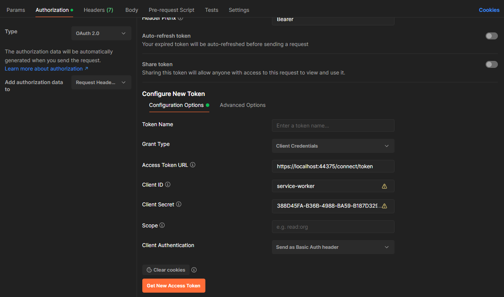

# 创建自己的服务器实例 <Badge type="danger" text="server" />

> [!NOTE]
> 本指南假设你使用 ASP.NET Core 来托管你的授权服务器。有关如何在 ASP.NET 4.6.1+ 应用程序中使用 OpenIddict 服务器功能的示例，
> 请参见 [OWIN/ASP.NET 4.8 示例](https://github.com/openiddict/openiddict-samples?tab=readme-ov-file#owinaspnet-48-samples)。

**使用 OpenIddict 实现自定义 OpenID Connect 服务器最简单的方法是克隆官方示例**
从 [openiddict-samples 仓库](https://github.com/openiddict/openiddict-samples)。

如果你不想从推荐的示例开始，你需要：

  - **重用现有项目或创建新项目**：使用 Visual Studio 的默认 ASP.NET Core 模板创建新项目时，
  强烈建议使用**个人用户账户认证**，因为它自动包含基于 Razor Pages 的默认 ASP.NET Core Identity UI，
  如果你之后需要实现用户认证流程（如授权码流程）的话。

  - **更新你的 `.csproj` 文件**以引用最新的 `OpenIddict.AspNetCore` 和 `OpenIddict.EntityFrameworkCore` 包：

  ```xml
  <PackageReference Include="OpenIddict.AspNetCore" Version="6.2.0" />
  <PackageReference Include="OpenIddict.EntityFrameworkCore" Version="6.2.0" />
  ```

  - **在 `Program.cs` 中注册你的 Entity Framework Core 数据库上下文并配置 OpenIddict 核心服务**
  （或 `Startup.cs`，取决于你使用的是最小主机还是常规主机）：

  ```csharp
  services.AddDbContext<ApplicationDbContext>(options =>
  {
      // 配置 Entity Framework Core 使用 Microsoft SQL Server。
      options.UseSqlServer(Configuration.GetConnectionString("DefaultConnection"));

      // 注册 OpenIddict 所需的实体集。
      // 注意：如果需要替换默认的 OpenIddict 实体，请使用泛型重载。
      options.UseOpenIddict();
  });

  services.AddOpenIddict()

      // 注册 OpenIddict 核心组件。
      .AddCore(options =>
      {
          // 配置 OpenIddict 使用 Entity Framework Core 存储和模型。
          // 注意：调用 ReplaceDefaultEntities() 来替换默认实体。
          options.UseEntityFrameworkCore()
                 .UseDbContext<ApplicationDbContext>();
      });
  ```

  - **配置 OpenIddict 服务器服务**：

  ```csharp
  services.AddOpenIddict()

      // 注册 OpenIddict 服务器组件。
      .AddServer(options =>
      {
          // 启用令牌端点。
          options.SetTokenEndpointUris("connect/token");

          // 启用客户端凭据流程。
          options.AllowClientCredentialsFlow();

          // 注册签名和加密凭据。
          options.AddDevelopmentEncryptionCertificate()
                 .AddDevelopmentSigningCertificate();

          // 注册 ASP.NET Core 主机并配置 ASP.NET Core 选项。
          options.UseAspNetCore()
                 .EnableTokenEndpointPassthrough();
      });
  ```

  - **确保 ASP.NET Core 认证中间件在正确的位置注册**：

  ```csharp
  app.UseDeveloperExceptionPage();

  app.UseForwardedHeaders();

  app.UseRouting();
  app.UseCors();

  app.UseAuthentication();
  app.UseAuthorization();

  app.UseEndpoints(options =>
  {
      options.MapControllers();
      options.MapDefaultControllerRoute();
  });
  ```

  - **创建你自己的授权控制器：**
  > [!NOTE]
  > 实现自定义授权控制器是必需的，以允许 OpenIddict 基于你提供的身份和声明创建令牌。

  这是客户端凭据授权的示例：

  ```csharp
  public class AuthorizationController : Controller
  {
      private readonly IOpenIddictApplicationManager _applicationManager;

      public AuthorizationController(IOpenIddictApplicationManager applicationManager)
          => _applicationManager = applicationManager;

      [HttpPost("~/connect/token"), Produces("application/json")]
      public async Task<IActionResult> Exchange()
      {
          var request = HttpContext.GetOpenIddictServerRequest();
          if (request.IsClientCredentialsGrantType())
          {
              // 注意：客户端凭据由 OpenIddict 自动验证：
              // 如果 client_id 或 client_secret 无效，此操作不会被调用。

              var application = await _applicationManager.FindByClientIdAsync(request.ClientId) ??
                  throw new InvalidOperationException("找不到应用程序。");

              // 创建一个新的 ClaimsIdentity，包含将用于创建 id_token、token 或 code 的声明。
              var identity = new ClaimsIdentity(TokenValidationParameters.DefaultAuthenticationType, Claims.Name, Claims.Role);

              // 使用 client_id 作为主题标识符。
              identity.SetClaim(Claims.Subject, await _applicationManager.GetClientIdAsync(application));
              identity.SetClaim(Claims.Name, await _applicationManager.GetDisplayNameAsync(application));

              identity.SetDestinations(static claim => claim.Type switch
              {
                  // 当授予 "profile" 作用域时，允许 "name" 声明同时存储在访问令牌和身份令牌中
                  // （通过调用 principal.SetScopes(...)）。
                  Claims.Name when claim.Subject.HasScope(Scopes.Profile)
                      => [Destinations.AccessToken, Destinations.IdentityToken],

                  // 否则，仅将声明存储在访问令牌中。
                  _ => [Destinations.AccessToken]
              });

              return SignIn(new ClaimsPrincipal(identity), OpenIddictServerAspNetCoreDefaults.AuthenticationScheme);
          }

          throw new NotImplementedException("未实现指定的授权类型。");
      }
  }
  ```

  - **注册你的客户端应用程序**（例如使用 `IHostedService` 实现）：

  ```csharp
  public class Worker : IHostedService
  {
      private readonly IServiceProvider _serviceProvider;

      public Worker(IServiceProvider serviceProvider)
          => _serviceProvider = serviceProvider;

      public async Task StartAsync(CancellationToken cancellationToken)
      {
          using var scope = _serviceProvider.CreateScope();

          var context = scope.ServiceProvider.GetRequiredService<ApplicationDbContext>();
          await context.Database.EnsureCreatedAsync();

          var manager = scope.ServiceProvider.GetRequiredService<IOpenIddictApplicationManager>();

          if (await manager.FindByClientIdAsync("service-worker") is null)
          {
              await manager.CreateAsync(new OpenIddictApplicationDescriptor
              {
                  ClientId = "service-worker",
                  ClientSecret = "388D45FA-B36B-4988-BA59-B187D329C207",
                  Permissions =
                  {
                      Permissions.Endpoints.Token,
                      Permissions.GrantTypes.ClientCredentials
                  }
              });
          }
      }

      public Task StopAsync(CancellationToken cancellationToken) => Task.CompletedTask;
  }
  ```

  > [!NOTE]
  > 在运行应用程序之前，确保通过运行 `Add-Migration` 和 `Update-Database` 更新数据库中的 OpenIddict 表。

  - 使用 Postman 测试你的服务器实现：



> [!TIP]
> 推荐阅读：[在你的 API 中实现令牌验证](implementing-token-validation-in-your-apis.md)。
