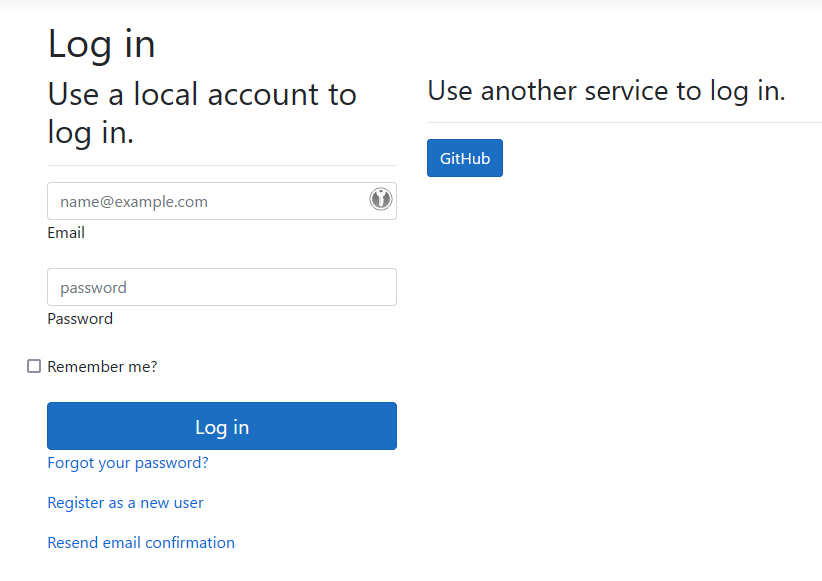

# 与远程服务器实例集成 <Badge type="warning" text="client" />

OpenIddict 客户端是一个通用的 OAuth 2.0/OpenID Connect .NET 客户端，可用于 Web 应用程序
(需要 ASP.NET 4.6.1+ 或 ASP.NET Core 2.1+) 或桌面应用程序 (需要 .NET 4.6.1+ 或 .NET 6.0+)。

> [!NOTE]
> 大多数设置同时适用于 Web 和桌面应用程序，但交互式流程（如代码或隐式流程）需要根据应用程序类型进行特定集成。

## 在任何 .NET 应用程序中实现非交互式 OAuth 2.0 客户端：

非交互式流程（如资源所有者密码凭据 (ROPC) 或客户端凭据）在 Web 和桌面应用程序中的实现方式相同。如果要使用非交互式流程（如客户端凭据流程），您需要：

  - **拥有现有项目或创建新项目**：对于非交互式流程，建议使用 .NET 通用主机，但不是必需的。无论如何，您都需要使用依赖注入（`Microsoft.Extensions.DependencyInjection` 或其他 DI 容器）。

  - **更新 `.csproj` 文件** 以引用最新的 `OpenIddict` 包：

    ```xml
    <PackageReference Include="OpenIddict" Version="6.2.0" />
    ```

  - **在 `Program.cs` 中配置 OpenIddict 客户端服务**（如果使用常规 ASP.NET Core Web 主机，则在 `Startup.cs` 中）：

    ```csharp
    services.AddOpenIddict()

        // 注册 OpenIddict 客户端组件。
        .AddClient(options =>
        {
            // 允许协商 grant_type=client_credentials。
            options.AllowClientCredentialsFlow();

            // 禁用令牌存储，这对于非交互式流程（如
            // grant_type=password、grant_type=client_credentials 或 grant_type=refresh_token）不是必需的。
            options.DisableTokenStorage();

            // 注册 System.Net.Http 集成。
            options.UseSystemNetHttp();

            // 添加客户端注册，包含服务器颁发的客户端标识符和密钥。
            options.AddRegistration(new OpenIddictClientRegistration
            {
                Issuer = new Uri("https://localhost:44385/", UriKind.Absolute),

                ClientId = "service-worker",
                ClientSecret = "388D45FA-B36B-4988-BA59-B187D329C207"
            });
        });
    ```

  - **使用 `OpenIddictClientService` 从远程服务器获取访问令牌：**
    ```csharp
    var service = provider.GetRequiredService<OpenIddictClientService>();

    var result = await service.AuthenticateWithClientCredentialsAsync(new());
    var token = result.AccessToken;
    ```

## 在 ASP.NET Core 应用程序中实现交互式 OAuth 2.0/OpenID Connect 客户端：

**要在 ASP.NET Core 应用程序中实现交互式 OAuth 2.0/OpenID Connect 客户端，最简单的方法是克隆
[openiddict-samples 仓库](https://github.com/openiddict/openiddict-samples) 中的官方示例之一。**

如果您不想从推荐的示例开始，您需要：

  - **拥有现有项目或创建新项目**：使用 Visual Studio 的默认 ASP.NET Core 模板创建新项目时，
  强烈建议使用**个人用户帐户身份验证**，因为它自动包含基于 Razor Pages 的默认 ASP.NET Core Identity UI，
  可以透明地处理用户创建过程或外部登录集成。

  - **更新 `.csproj` 文件** 以引用最新的 `OpenIddict.AspNetCore` 和 `OpenIddict.EntityFrameworkCore` 包：

  ```xml
  <PackageReference Include="OpenIddict.AspNetCore" Version="6.2.0" />
  <PackageReference Include="OpenIddict.EntityFrameworkCore" Version="6.2.0" />
  ```

  - **在 `Program.cs` 中配置 OpenIddict 核心服务**（根据您使用的是最小主机还是常规主机，可能在 `Startup.cs` 中）：

  > [!IMPORTANT]
  > 配置数据库是必需的，因为 OpenIddict 客户端默认是有状态的：它使用 `IOpenIddictTokenStore<T>`
  > 服务来存储它创建的状态令牌的有效负载 - 以保护回调阶段免受 CSRF/会话固定攻击 -
  > 并启用自动状态令牌兑换（与 ASP.NET Core OAuth 2.0 或 OpenID Connect 处理程序不同，OpenIddict 客户端
  > 防止状态令牌被多次使用，以减轻授权响应/状态令牌重放攻击）。

  ```csharp
  services.AddDbContext<ApplicationDbContext>(options =>
  {
      // 配置 Entity Framework Core 使用 Microsoft SQL Server。
      options.UseSqlServer(Configuration.GetConnectionString("DefaultConnection"));

      // 注册 OpenIddict 所需的实体集。
      // 注意：如果需要替换默认的 OpenIddict 实体，请使用通用重载。
      options.UseOpenIddict();
  });
  ```

  ```csharp
  services.AddOpenIddict()

      // 注册 OpenIddict 核心组件。
      .AddCore(options =>
      {
          // 配置 OpenIddict 使用 Entity Framework Core 存储和模型。
          // 注意：调用 ReplaceDefaultEntities() 来替换默认实体。
          options.UseEntityFrameworkCore()
                 .UseDbContext<ApplicationDbContext>();
      });
  ```

  - **配置 OpenIddict 客户端服务**。以下是一个启用代码流支持并添加 GitHub 集成的示例：

  ```csharp
  services.AddOpenIddict()

      // 注册 OpenIddict 客户端组件。
      .AddClient(options =>
      {
          // 注意：此示例仅使用授权代码流，
          // 但您可以在必要时启用其他流程。
          options.AllowAuthorizationCodeFlow();

          // 注册用于保护敏感数据（如 OpenIddict 生成的状态令牌）的签名和加密凭据。
          options.AddDevelopmentEncryptionCertificate()
                 .AddDevelopmentSigningCertificate();

          // 注册 ASP.NET Core 主机并配置 ASP.NET Core 特定选项。
          options.UseAspNetCore()
                 .EnableRedirectionEndpointPassthrough();

          // 注册 System.Net.Http 集成。
          options.UseSystemNetHttp();

          // 注册 Web 提供商集成。
          //
          // 注意：为了减轻混合攻击，建议为每个提供商使用唯一的重定向端点
          // URI，除非所有注册的提供商都支持在授权响应中返回包含其 URL 的特殊 "iss"
          // 参数。有关更多信息，请参阅 https://datatracker.ietf.org/doc/html/draft-ietf-oauth-security-topics#section-4.4。
          options.UseWebProviders()
                 .AddGitHub(options =>
                 {
                     options.SetClientId("c4ade52327b01ddacff3")
                            .SetClientSecret("da6bed851b75e317bf6b2cb67013679d9467c122")
                            .SetRedirectUri("callback/login/github");
                 });
      });
  ```

  - **确保 ASP.NET Core 身份验证中间件在正确的位置正确注册**：

  ```csharp
  app.UseDeveloperExceptionPage();

  app.UseForwardedHeaders();

  app.UseRouting();
  app.UseCors();

  app.UseAuthentication();
  app.UseAuthorization();

  app.UseEndpoints(options =>
  {
      options.MapControllers();
      options.MapDefaultControllerRoute();
  });
  ```

  - **添加一个负责处理 OAuth 2.0/OpenID Connect 回调的身份验证控制器：**

  ```csharp
  [HttpGet("~/callback/login/{provider}"), HttpPost("~/callback/login/{provider}"), IgnoreAntiforgeryToken]
  public async Task<ActionResult> LogInCallback()
  {
      // 检索由 OpenIddict 作为回调处理的一部分验证的授权数据。
      var result = await HttpContext.AuthenticateAsync(OpenIddictClientAspNetCoreDefaults.AuthenticationScheme);
  
      // 重要：如果远程服务器不支持 OpenID Connect 并且不公开 userinfo 端点，
      // result.Principal.Identity 将表示一个未经验证的身份，并且不包含任何用户声明。
      //
      // 这样的身份不能直接用于在 ASP.NET Core 中构建身份验证 cookie（因为
      // 防伪堆栈需要至少一个名称声明来将 CSRF cookie 绑定到用户身份），但
      // 可以使用 result.Properties.GetTokens() 检索访问/刷新令牌来进行 API 调用。
      if (result.Principal is not ClaimsPrincipal { Identity.IsAuthenticated: true })
      {
          throw new InvalidOperationException("The external authorization data cannot be used for authentication.");
      }
  
      // 基于外部声明构建一个身份，该身份将用于创建身份验证 cookie。
      var identity = new ClaimsIdentity(authenticationType: "ExternalLogin");
  
      // 默认情况下，OpenIddict 将自动尝试从标准 OpenID Connect 或提供商特定的等效项映射
      // email/name 和名称标识符声明（如果可用）。如果需要，可以从外部身份解析其他声明
      // 并复制到最终的身份验证 cookie。
      identity.SetClaim(ClaimTypes.Email, result.Principal.GetClaim(ClaimTypes.Email))
              .SetClaim(ClaimTypes.Name, result.Principal.GetClaim(ClaimTypes.Name))
              .SetClaim(ClaimTypes.NameIdentifier, result.Principal.GetClaim(ClaimTypes.NameIdentifier));
  
      // 保留注册标识符以便稍后解析。
      identity.SetClaim(Claims.Private.RegistrationId, result.Principal.GetClaim(Claims.Private.RegistrationId));
  
      // 基于触发质询时添加的属性构建身份验证属性。
      var properties = new AuthenticationProperties(result.Properties.Items)
      {
          RedirectUri = result.Properties.RedirectUri ?? "/"
      };
  
      // 如果需要，可以将授权服务器返回的令牌存储在身份验证 cookie 中。
      //
      // 为了使 cookie 不那么重，在创建 cookie 之前会过滤掉未使用的令牌。
      properties.StoreTokens(result.Properties.GetTokens().Where(token => token.Name is
          // 保留令牌响应中返回的访问、身份和刷新令牌（如果可用）。
          OpenIddictClientAspNetCoreConstants.Tokens.BackchannelAccessToken   or
          OpenIddictClientAspNetCoreConstants.Tokens.BackchannelIdentityToken or
          OpenIddictClientAspNetCoreConstants.Tokens.RefreshToken));
  
      // 要求默认的登录处理程序返回一个新的 cookie 并将
      // 用户代理重定向到存储在身份验证属性中的返回 URL。
      //
      // 对于不应使用 ASP.NET Core 身份验证选项中配置的默认登录处理程序的场景，
      // 可以在此处指定特定的方案。
      return SignIn(new ClaimsPrincipal(identity), properties);
  }
  ```

  - 正确配置后，GitHub 提供商应出现在支持的外部提供商列表中：



> [!TIP]
> 有关 OpenIddict 客户端开箱即用支持的知名服务的更多信息，请阅读 [Web 提供商](/integrations/web-providers.md)。

## 在移动或桌面应用程序中实现交互式 OAuth 2.0/OpenID Connect 客户端：

**要在移动或桌面应用程序中实现交互式 OAuth 2.0/OpenID Connect 客户端，最简单的方法是克隆
[openiddict-samples 仓库](https://github.com/openiddict/openiddict-samples) 中的官方示例之一。**

> [!TIP]
> 有关如何在 Android、iOS、Linux、macOS、Mac Catalyst 和 Windows 上使用 OpenIddict 客户端的更多信息，
> 请阅读 [操作系统集成](/integrations/operating-systems.md)。
